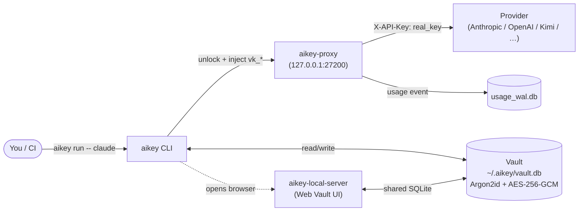
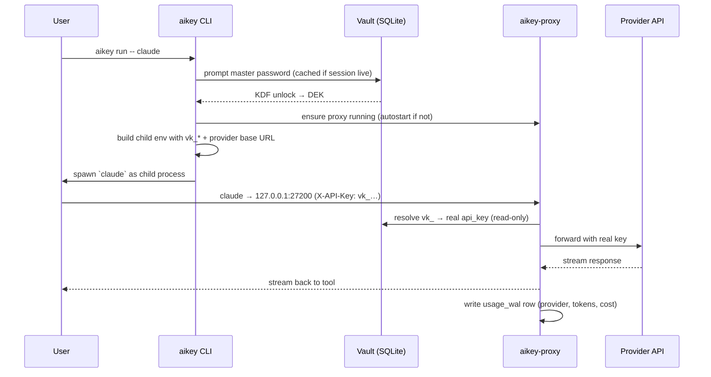

# AiKey CLI

> 🌐 **English** | [中文](./README.zh.md)

[](https://crates.io/crates/aikeylabs-aikey-cli)
[](LICENSE)
[](https://github.com/aikeylabs/launch/issues)

**Secure local-first credential vault + runtime routing for AI tools.** Manage API keys and provider OAuth accounts in an encrypted local vault, distribute revocable route tokens to daily tools (Claude / Codex / Kimi / etc.), and observe per-key usage — without ever pasting real credentials into project files or env vars.

## 1. Responsibilities

**Does**

- Store API keys + provider OAuth tokens in a local SQLite vault, encrypted with Argon2id + AES-256-GCM.
- Issue revocable **virtual keys** (`aikey_vk_*`) that route through `aikey-proxy` to upstream providers.
- Inject credentials at runtime via `aikey run -- <cmd>` or shell hook — no env var pollution outside the child process.
- Track per-key / per-provider usage, surface cost receipts after each session.
- Open the local Vault Web UI (`aikey web`) served by `aikey-local-server`.

**Does NOT**

- Export plaintext secrets to files, env vars, or stdout (no `aikey export`, no eval-style injection).
- Sync vault to cloud by default. The vault is **device-local**; cross-device migration is explicitly out of scope until further notice.
- Replace your provider account. AiKey is a **runtime credential layer** — keys still belong to your providers.

**Sibling components** (each has its own repo)

- [`aikey-proxy`](https://github.com/aikeylabs/aikey-proxy) — Local HTTP/HTTPS proxy that resolves virtual keys → real provider keys and records usage.
- [`aikey-local-server`](https://github.com/aikeylabs/aikey-local-server) — Local web server that serves the Vault UI to `aikey web`.

## 2. Architecture



**Why this shape**: the CLI never sees the real provider key after vault unlock — `aikey-proxy` does the substitution at the TLS edge. Tools see only a stable virtual key (`aikey_vk_*`); rotating the real key behind it does not touch any tool config.

## 3. Call Sequence — `aikey run -- claude`



The vault is only unlocked once per shell session by default — subsequent `aikey run` calls reuse the cached DEK until session timeout.

## 4. Data Flow

| Command | Reads | Writes | Downstream consumer |
|---------|-------|--------|---------------------|
| `aikey add <alias>` | vault.db (alias uniqueness) | vault.db (encrypted blob) | proxy on next request |
| `aikey use <alias>` | vault.db | `active_env` config file | shell hook (env injection) |
| `aikey run -- <cmd>` | vault.db | child process env only | child process |
| `aikey import <file>` | input file | vault.db (bulk) | web UI for confirmation |
| `aikey auth login <provider>` | OAuth callback | vault.db (token record) | proxy on next request |
| `aikey web [page]` | none | none | spawns browser → aikey-local-server |
| `aikey hook install` | shell rc (`.zshrc` / `.bashrc`) | shell rc + `~/.aikey/hook.sh` | every new terminal |
| `aikey doctor` | proxy port, vault path, hooks | none (diagnose only) | stdout report |

Real credentials never leave `vault.db` except as the substituted `X-API-Key` header inside the proxy → provider call.

## 5. Tech Stack

| Layer | Choice | Why |
|-------|--------|-----|
| Language | Rust 2021 | Single static binary, no runtime dep on host; type-safe key handling |
| CLI parsing | `clap` v4 derive | Declarative; auto `--help`; subcommand aliases (`ls`, `browse`) |
| Storage | SQLite via `rusqlite` (`bundled`) | Zero install footprint; no service required; portable file |
| Password KDF | Argon2id (m=64 MiB, t=3, p=4) | OWASP-recommended; resists GPU attacks |
| Symmetric crypto | AES-256-GCM (`aes-gcm`) | AEAD, authenticated; NIST-approved |
| Memory hygiene | `secrecy` + `zeroize` | Sensitive bytes wiped on drop; never logged via `Debug` |
| OAuth | provider-specific in `commands_auth/` | Native OAuth 2.0 + PKCE; no third-party broker |
| Clipboard (Magic Add) | `arboard` | Cross-platform paste detection |
| Password prompt | `rpassword` | TTY echo-off; works in restricted shells |

**Pinned decision**: `rusqlite` with `bundled` means SQLite is statically linked. Trade-off is +1.5 MB binary size for zero host-SQLite version variance.

## 6. Runtime Environment

| Item | Requirement |
|------|-------------|
| OS | macOS 12+ / Linux (Ubuntu 20.04+, CentOS 8+, Alpine 3.16+) / Windows 10+ |
| Architecture | x86_64 / arm64 |
| Runtime deps | **None** (single static binary) |
| Disk | ~30 MB binary + vault grows ~1 KB per key |
| Network | Outbound to provider APIs only; proxy binds to `127.0.0.1:27200` (loopback) |

**Filesystem layout** (`$AIKEY_HOME`, default `~/.aikey/`):

```
~/.aikey/
├── vault.db          # encrypted SQLite (file mode 0600)
├── identity          # local installer ID (uuid, anonymous)
├── hook.sh           # sourced from your shell rc
├── active_env        # current `aikey use` selections (per-provider)
├── proxy/            # aikey-proxy state (PID file, logs)
└── backups/          # automatic vault backups before destructive ops
```

**Default proxy port**: `127.0.0.1:27200`. Override via `AIKEY_PROXY_PORT` env if 27200 is taken.

## 7. Quick Start

```bash
# 1. Install (auto-detects OS)
curl -fsSL https://aikeylabs.com/i/of | sh

# 2. Re-source your shell so PATH picks up the binary
source ~/.zshrc                              # or ~/.bashrc

# 3. Add your first key (vault auto-initializes — prompts for master password on first run)
aikey add my-claude --provider anthropic

# 4. Activate the key
aikey use my-claude

# 5. Run a tool through aikey (proxy autostarts if needed)
aikey run -- claude
```

After step 5, the `claude` CLI talks to `127.0.0.1:27200`, which substitutes your virtual key for the real Anthropic key. A cost receipt prints on session exit.

## 8. Startup Notes

What auto-fires on first launch (and why):

| Trigger | What happens | Why |
|---------|--------------|-----|
| First `aikey <any-command>` | Vault auto-init at `~/.aikey/vault.db`, prompts master password | Avoid a manual `aikey vault init` ceremony |
| First `aikey run` per shell | `aikey-proxy` autostarts on `127.0.0.1:27200` if not running | Tool invocations don't fail with "proxy not up" |
| First install | `~/.aikey/identity` generated (anonymous uuid) | Local stats + future invite features; not tied to email |
| `aikey hook install` | Appends 1 line to `~/.zshrc` / `~/.bashrc` | Future terminals load `active_env` so `claude` "just works" without `aikey run` |
| Vault unlock | DEK cached in memory for the shell session | Avoid re-prompting password for every command |

> **Reset / forget**: delete `~/.aikey/identity` to regenerate the installer ID. Delete `~/.aikey/vault.db` to start over (irreversible — back it up first).

## 9. Usage Examples

```bash
# Inventory
aikey list                                  # or `aikey ls`
aikey whoami                                # who am I + currently active key
aikey route                                 # third-party client integration map

# Add credentials
aikey add my-claude --provider anthropic    # single key via prompt
aikey import ~/keys.txt                     # bulk import via browser UI
aikey auth login claude                     # OAuth Pro/Max account

# Activation
aikey use my-claude                         # global active (persisted to active_env)
aikey activate my-claude                    # current shell only (temporary)
aikey deactivate                            # restore previous global state
aikey unuse anthropic                       # clear active for one provider (multi-arg OK)

# Run tools
aikey run -- claude                         # one-shot through proxy
aikey run -- python eval.py                 # works with any tool that reads provider env

# Web Vault UI
aikey web                                   # opens local console (default page)
aikey web usage                             # jumps straight to Usage page
aikey web vault                             # jumps straight to Vault page

# Maintenance
aikey doctor                                # diagnose PATH / hook / proxy / vault
aikey test --all                            # connectivity test all keys
aikey env                                   # show injected env for current shell
aikey proxy restart                         # restart the local proxy
```

Run `aikey --help` for the full subcommand list (display order = frequency, frequent first).

## 10. Error Codes

CLI errors return a structured `error_code` (mirrored in `_internal` IPC and `aikey-local-server` API responses). [`src/error_codes.rs`](src/error_codes.rs) is the source of truth; the table below is the **stable user-facing subset**.

| Code | When | Next step |
|------|------|-----------|
| `ALIAS_EXISTS` | `aikey add <alias>` collides with existing | Use a different alias or `aikey remove <alias>` first |
| `ALIAS_NOT_FOUND` | `aikey use / activate / run` references unknown alias | `aikey list` to see what's available |
| `VAULT_LOCKED` | Operation needs master password but session expired | Re-run command, enter master password when prompted |
| `VAULT_NOT_INITIALIZED` | First-time vault file missing | Run any `aikey` command; auto-init will prompt |
| `NO_ACTIVE_PROFILE` | `aikey run` invoked without `aikey use` first | `aikey use <alias>` to select a key |
| `INVALID_INPUT` | Argument shape wrong (e.g. unknown provider name) | Check `aikey <subcmd> --help` |
| `UNSUPPORTED_PROTOCOL` | OAuth / proxy version mismatch | Update CLI: `curl -fsSL https://aikeylabs.com/i/of \| sh` |
| `TIMEOUT` | Proxy / provider didn't respond | `aikey doctor`; check outbound network |
| `IO_ERROR` | Filesystem / network unexpected error | Check disk space, file perms (`~/.aikey` must be 0700) |

`_internal` IPC codes (prefix `I_*`, used between CLI and `aikey-local-server`) — full table in [docs/VAULT_SPEC.md](docs/VAULT_SPEC.md); you only see these in `aikey-local-server` logs.

## 11. Project Structure

```
aikey-cli/
├── src/
│   ├── main.rs                   # entry + global error handling
│   ├── cli.rs                    # clap definitions (all subcommands)
│   ├── lib.rs                    # public API for aikey-sdk / aikey-local-server
│   ├── storage.rs                # vault SQLite open/migrate/query
│   ├── storage_platform.rs       # platform account + virtual key cache
│   ├── error_codes.rs            # central error enum (source of truth)
│   ├── observability.rs          # event names + structured logging
│   ├── audit.rs                  # audit log writer
│   ├── executor.rs               # `aikey run` child-process spawning
│   ├── commands_account/         # account / OAuth / `use` / `browse` / `status`
│   ├── commands_auth/            # OAuth flows (per provider)
│   ├── commands_app/             # third-party app integration helpers
│   ├── commands_env.rs           # `aikey env` / `aikey env set`
│   ├── commands_import.rs        # bulk import via web UI
│   ├── commands_init.rs          # vault init
│   ├── commands_project.rs       # `aikey project init`
│   ├── commands_proxy.rs         # proxy lifecycle (start/stop/restart)
│   ├── commands_statusline.rs    # shell statusline integration
│   └── commands_watch.rs         # watch mode for usage events
├── aikey-sdk/                    # reusable lib crate (used by other Rust callers)
├── docs/                         # VAULT_SPEC.md + cli-platform-contract.md
├── scripts/                      # one-off probes (kimi / statusline / e2e dashboards)
├── tests/                        # integration tests
└── Cargo.toml                    # workspace root
```

## 12. Links

- 🐛 **Issues / feature requests**: https://github.com/aikeylabs/launch/issues
- 📖 **Vault spec (deep dive)**: [docs/VAULT_SPEC.md](docs/VAULT_SPEC.md)
- 🔌 **CLI platform contract**: [docs/cli-platform-contract.md](docs/cli-platform-contract.md)
- 🤝 **Contributing**: [CONTRIBUTING.md](CONTRIBUTING.md)
- 🔒 **Security policy**: [SECURITY.md](SECURITY.md)
- 🌐 **Main site**: https://aikeylabs.com — install command + docs + enterprise
- 📦 **Sibling repos**: [aikey-proxy](https://github.com/aikeylabs/aikey-proxy) · [aikey-local-server](https://github.com/aikeylabs/aikey-local-server)

---

**License**: Apache-2.0 © AiKey Labs. See [LICENSE](LICENSE).
