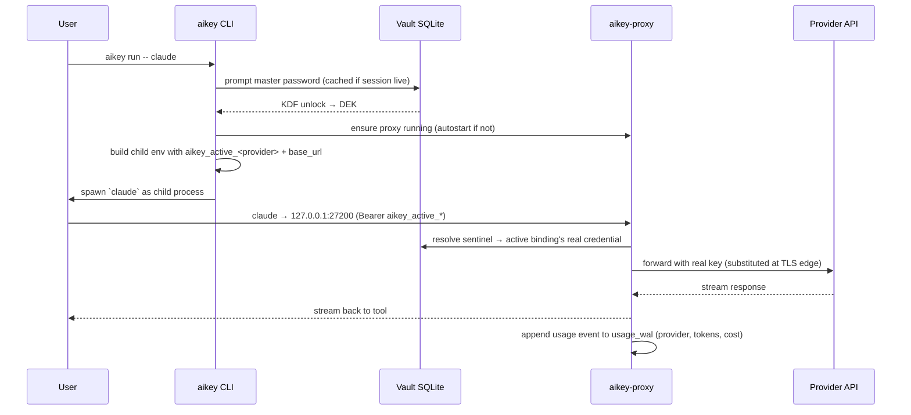

# AiKey CLI

> 🌐 **English** | [中文](./README.zh.md)

[](https://crates.io/crates/aikeylabs-aikey-cli)
[](LICENSE)
[](https://github.com/aikeylabs/launch/issues)
[](https://github.com/aikeylabs)

**FinOps & AI governance for AI provider keys.** Encrypted local vault for your Claude / Codex / Kimi / OpenAI keys + OAuth accounts. Routes every AI request through a local proxy you control — so cost, routing, and audit stay on your machine, and tools see only revocable route tokens instead of real provider keys.

## ✨ Highlights

- **One vault for every AI credential.** API keys *and* OAuth accounts (Claude Pro/Max, Codex/ChatGPT, Kimi) live together in one encrypted local vault. Tools only ever see revocable route tokens — rotate or swap the real key and no tool config changes.
- **Switch provider / account mid-work, without breaking your flow.** `aikey use <alias>` flips the active credential for *every* tool at once; the shell hook makes new terminals just work; `aikey activate` scopes a switch to just the current shell. Quota exhausted on one upstream? Route groups keep the failover order — the session keeps going.
- **One key, multiple protocols.** Aggregator gateways (OpenRouter-style relays) that speak both Anthropic and OpenAI protocols register once with `aikey add --providers anthropic,openai` — the proxy routes each request by protocol, one vault entry covers both.
- **A cost receipt after every session.** `aikey run -- claude` prints what the session cost when it exits. `aikey watch` is a `top`-style live usage dashboard; `aikey web usage` opens the local trends console. Your FinOps data never leaves your machine.
- **Every AI tool becomes a governed app.** `aikey app register` gives each agent (Cursor, OpenCode, custom bots) its own bearer + its own binding — pause, rotate, or revoke one tool in one command without touching the others.
- **Import the mess you already have.** `aikey import` bulk-parses unstructured text (env files, notes, chat pastes) with a browser confirm flow. `aikey add --from-url` reads a relay's self-description — then *verifies it with a live probe* and stores only what actually answered.
- **Self-healing diagnostics.** `aikey doctor` doesn't just report — it restarts a stopped proxy, revives the web console, reinstalls a missing shell hook. `--last-errors` explains recent failures as a caused-by tree with trace IDs.
- **Know when you're being degraded.** `aikey trust` (via the optional degrade-detector plugin) checks whether an upstream silently substituted a weaker model behind your key.
- **Compliance scanning, one switch.** `aikey compliance on` scans request content *before* it leaves your machine — pre-forward, inside the local proxy, no external service.
- **Beyond the terminal.** Route Claude Desktop through the same governance (`aikey desktop install`), get per-conversation cost in your Claude Code status line (`aikey statusline install`), and watch it all from the desktop tray.
- **Audit-grade usage completeness.** `aikey audit status` accounts for every usage record — allocated / confirmed / gaps / known-loss — and `aikey audit reconcile` actively re-delivers what's recoverable.

One static binary. No runtime dependencies. Works offline. Apache-2.0.

## 1. Responsibilities

**Does**

- Store API keys + provider OAuth tokens in a local SQLite vault, encrypted with Argon2id + AES-256-GCM.
- Issue revocable **route tokens** (`aikey_personal_<64-hex>` / `aikey_team_<vk_id>` / `aikey_active_<provider>`) that route through `aikey-proxy` to upstream providers.
- Inject credentials at runtime via `aikey run -- <cmd>` or shell hook — no env var pollution outside the child process.
- Track per-key / per-provider usage; surface cost receipts after each session.
- Open the local Vault Web UI (`aikey web`) served by `aikey-local-server`.

**Does NOT**

- Export plaintext secrets to files, env vars, or stdout (`aikey export` writes an **encrypted** `.akb` backup only — no plaintext export path, no eval-style injection).
- Sync vault to cloud by default. The vault is **device-local**; cross-device migration is explicitly out of scope.
- Replace your provider account. AiKey is a **runtime credential layer** — keys still belong to your providers.
- Send telemetry from local CLI invocations. The `aikeylabs.com` install wrapper does send anonymous install events; unset `AIKEY_TELEMETRY_TOKEN` to disable.

**Sibling components** (each has its own repo, all under [github.com/aikeylabs](https://github.com/aikeylabs))

- [`aikey-proxy`](https://github.com/aikeylabs/aikey-proxy) — Local HTTP proxy. Resolves route tokens → real credentials at the egress edge.
- [`aikey-local-server`](https://github.com/aikeylabs/aikey-local-server) — Local web server backing `aikey web` (Vault UI + cost dashboard).

## 2. Architecture


**Why this shape**: the CLI never sees the real provider key after vault unlock — `aikey-proxy` does the substitution at the TLS-edge HTTP boundary. Tools see only a stable route token; rotating the real key behind the vault entry does not touch any tool config.

The web UI doesn't talk to vault directly. It calls `aikey-local-server`, which spawns the CLI in subprocess mode (`aikey _internal vault-op …`) — so Web and CLI go through the **same Rust code path** for every vault mutation. No drift between "what CLI does" and "what web does".

## 3. Call Sequence — `aikey run -- claude`



Vault is unlocked once per shell session — subsequent `aikey run` calls reuse the cached DEK until session timeout. Subsequent runs in other shells share nothing (no cross-shell leak).

## 4. Data Flow

| Command | Reads | Writes | Downstream consumer |
|---|---|---|---|
| `aikey add <alias>` | vault.db (alias uniqueness) | vault.db (encrypted entry) | proxy on next request |
| `aikey auth login <provider>` | OAuth callback over loopback | vault.db (provider_account row + OAuth token) | proxy on next request |
| `aikey use <alias>` | vault.db | `~/.aikey/active.env` + provider bindings | shell hook / `aikey run` env injection |
| `aikey run -- <cmd>` | vault.db (active binding) | child process env only | child process |
| `aikey app register --slug <slug> …` | vault.db (current `aikey use` selection, snapshotted as the app's binding) | vault.db (app_records UPSERT + app bearer + binding snapshot) | third-party agent via `aikey_app_<64-hex>` |
| `aikey route` | vault.db (read-only) | nothing | stdout (for copying into third-party tool config) |
| `aikey test [<alias>]` | vault.db | nothing (probe-only via `X-Aikey-Probe: 1`) | proxy → upstream `/v1/models` |
| `aikey web [page]` | nothing | nothing | spawns browser → `aikey-local-server` |
| `aikey doctor` | edition, proxy, vault, hooks, plugins (trust-local / compliance), **licensed identity** (`GET /v1/license/identity` on the signed-in control plane); `--last-errors` reads the proxy's local recent-error ring | auto-repairs in interactive mode: restarts a stopped proxy, starts a stopped local-server and trust-local daemon, installs a missing shell hook (`--json`: read-only) | stdout report (`--detail` adds edition-aware ODS panels; `--last-errors` renders origin, hops, trace ID, and upstream request ID) |
| `aikey audit status` | collector completeness endpoint (+ proxy local state: usage WAL/dead-letter **and** the compliance upload queue) | nothing | stdout per-source delivery report + local delivery lanes |
| `aikey audit reconcile` | collector gaps + proxy WAL | known-loss ledger (server) | stdout verdict; re-sends recoverable gaps, confirms losses |

Real credentials never leave `vault.db` except as the substituted upstream auth header inside the proxy → provider call. Probe traffic carries `X-Aikey-Probe: 1` so it does not pollute usage receipts.

## 5. Tech Stack & Why

| Layer | Choice | Why |
|---|---|---|
| Language | Rust 2021 | Single static binary, no runtime dep on host; memory-safe key handling |
| CLI parsing | `clap` v4 derive | Declarative; auto `--help`; subcommand aliases (`ls`, `browse`) |
| Storage | SQLite via `rusqlite` (`bundled`) | Zero install footprint; no service required; file is portable |
| Password KDF | Argon2id, **m=64 MiB, t=3, p=4** ([crypto.rs:24](src/crypto.rs)) | OWASP-recommended; resists GPU attacks |
| Symmetric crypto | AES-256-GCM ([crypto.rs:9](src/crypto.rs)) | AEAD, authenticated; NIST-approved |
| Memory hygiene | `secrecy` + `zeroize` | Sensitive bytes wiped on drop; never logged via `Debug` |
| OAuth | provider-specific in `commands_auth/` | Native OAuth 2.0 + PKCE; no third-party broker; broker runs locally |
| Password prompt | `rpassword` | TTY echo-off; works in restricted shells |
| IPC (CLI ↔ local-server) | JSON envelope over stdin/stdout (`_internal vault-op`) | One Rust code path for vault writes whether CLI- or web-triggered |

**Pinned decision**: `rusqlite` with `bundled` means SQLite is statically linked. Trade-off is +1.5 MB binary size for zero host-SQLite version variance.

## 6. Runtime Environment

| Item | Requirement |
|---|---|
| OS | macOS 12+ / Linux (Ubuntu 20.04+, CentOS 8+, Alpine 3.16+) / Windows 10+ |
| Architecture | x86_64 / arm64 |
| Runtime deps | **None** (single static binary) |
| Disk | ~30 MB binary + vault grows ~1 KB per credential |
| Network | Outbound to provider APIs only; proxy binds `127.0.0.1:27200` (loopback) |

**Filesystem layout** (`$AIKEY_HOME`, default `~/.aikey/`)

```
~/.aikey/
├── bin/                # aikey, aikey-proxy, ak (symlink), [aikey-local-server]
├── config/             # rendered service configs (aikey-proxy.yaml, etc.)
├── data/
│   └── vault.db        # encrypted SQLite, file mode 0600
├── logs/               # CLI + proxy logs (rotated)
├── active.env          # current `aikey use` selections (per-provider)
├── identity            # anonymous local installer UUID
├── hook.sh             # sourced from your shell rc when hook is installed
├── uninstall.sh        # full cleanup script, run with --yes
└── backups/            # automatic vault snapshots before destructive ops
```

**Default ports**: `127.0.0.1:27200` (proxy) and `127.0.0.1:8090` (local-server / web UI). Override via `AIKEY_PROXY_PORT` / `CONSOLE_PORT` env.

## 7. Quick Start

```bash
# 1. Install (auto-detects OS, installs to ~/.aikey/)
curl -fsSL https://aikeylabs.com/i/of | bash

# 2. Re-source your shell so PATH picks up the binary
source ~/.zshrc      # or ~/.bashrc

# 3. Add your first key — vault auto-initializes, prompts for master password
aikey add my-claude --provider anthropic

# 4. Activate the key for the anthropic provider
aikey use my-claude

# 5. Run a tool through aikey (proxy autostarts if needed)
aikey run -- claude
```

After step 5, `claude` talks to `127.0.0.1:27200`, which substitutes your route token for the real Anthropic key. A cost receipt prints when the session exits.

For OAuth (Claude Pro/Max, ChatGPT Plus, Kimi Code) instead of API key: `aikey auth login claude` (or `codex` / `kimi`).

## 8. Startup Notes

What auto-fires on first launch (and why):

| Trigger | What happens | Why |
|---|---|---|
| First `aikey <any-command>` | Vault auto-init at `~/.aikey/data/vault.db`; prompts master password | Avoid a manual `aikey vault init` ceremony |
| First `aikey run` per shell | `aikey-proxy` autostarts on `127.0.0.1:27200` if not running | Tool invocations don't fail with "proxy not up" |
| First install | `~/.aikey/identity` generated (anonymous UUID) | Anonymous install correlation only; not tied to email |
| `aikey hook install` | Appends 1 line to `~/.zshrc` / `~/.bashrc` | Future terminals load `active.env` so `claude` "just works" without `aikey run` |
| Vault unlock | DEK cached in memory for the shell session | Avoid re-prompting password for every command |

> **Reset / forget**: delete `~/.aikey/identity` to regenerate the installer ID. Run `~/.aikey/uninstall.sh --yes` for full cleanup (irreversible — automatic backup is taken first in `~/.aikey/backups/`).

## 9. Usage Examples

```bash
# Inventory
aikey list                                  # or `aikey ls`
aikey route                                 # third-party client integration map
aikey whoami                                # current active key + identity

# Add credentials
aikey add my-claude --provider anthropic    # single key via prompt
aikey add my-relay --from-url https://api.example-relay.com
                                            # read the relay's own description,
                                            # then STORE ONLY WHAT ANSWERS
aikey auth login claude                     # OAuth account (Pro/Max)
aikey import ~/keys.txt                     # bulk import via browser confirmation

# Activation
aikey use my-claude                         # global active (persists to active.env)
aikey activate my-claude                    # current shell only (temporary)
aikey deactivate                            # restore previous global state
aikey unuse anthropic                       # clear active for one provider

# Run tools
aikey run -- claude                         # one-shot through proxy
aikey run -- python eval.py                 # works with any tool reading provider env

# Third-party agents (per-app bearer + per-app binding)
aikey app register --slug my-cursor --name "Cursor" --upstreams openai
                                            # → prints OPENAI_BASE_URL + app bearer
                                            #   (idempotent: re-run reuses the bearer)
aikey app route my-cursor                   # optional: override the per-upstream binding
aikey app reveal-token my-cursor            # re-print a misplaced bearer (vault-gated)
aikey app rotate my-cursor                  # suspected leak: revoke + reissue atomically
aikey app revoke my-cursor                  # immediate revocation

# Claude Desktop routing
aikey desktop status                        # detection, consent, gateway reachability
aikey desktop install                       # route Claude Desktop through aikey
aikey desktop uninstall                     # restore official mode (undoes only aikey's takeover)

# Compliance content scanning (pre-forward stage)
aikey compliance status                     # on / off, and who decided it
aikey compliance on                         # scan request content before forwarding upstream
aikey compliance off                        # refused (with explanation) when org policy mandates it

# Web Vault UI
aikey web                                   # opens local console (default page)
aikey web usage                             # jump straight to Usage page
aikey web vault                             # jump straight to Vault page
aikey web --copy-url                        # copy the authed URL instead of opening a browser

# Display preferences (presentation only)
aikey config time-zone Asia/Shanghai        # Beijing / Shanghai, China Standard Time
aikey config time-zone auto                 # follow this device's system time zone
aikey config language zh                    # desktop tray language: auto / en / zh

# Maintenance
aikey doctor                                # diagnose PATH / hook / proxy / vault
aikey doctor --last-errors                  # explain recent proxy errors as a caused-by tree (local state only)
aikey test --all                            # connectivity test all credentials
aikey watch                                 # top-style live dashboard of recent usage (local WAL)
aikey proxy restart                         # restart the local proxy
aikey export "*" backup.akb                 # encrypted backup of matching secrets (.akb)
aikey change-password                       # rotate the vault master password

# Service status (which daemons are up)
aikey service status                        # one line each: web / proxy / trust-local
aikey web status                            # local web console: running? port? vault state?
aikey proxy status                          # proxy: running? pid? listen addr?
aikey service status trust-local            # a single service in detail

# Bring services up/down together (`all` = every installed service)
aikey service start all                     # start proxy + web + trust-local (skips not-installed / already-up)
aikey service stop all                      # stop everything that's running
aikey service restart all                   # restart every installed service

# Delivery audit (financial-grade usage completeness)
aikey audit status                          # per-source: allocated / confirmed / gaps / known-loss / quarantine
                                            # plus the local compliance upload queue (undelivered audit records)
aikey audit reconcile                       # actively reconcile now: re-send recoverable gaps, confirm true losses
aikey proxy replay-dead-letter              # deliver whatever is queued (usage + compliance) after fixing the cause
```

`aikey audit status` ends with the proxy's two local delivery lanes. The compliance
line is the one to watch on Production/Cluster: a non-empty queue means audit
records exist that the Control Panel has **not** received yet — they are delayed,
not lost, and `aikey proxy replay-dead-letter` delivers them once the cause is
fixed. A `HTTP 400` there is the version-skew signature (the Control Panel is
older than this proxy and rejects the payload); upgrade the server side first.
If the line reads `not reported by this proxy (older build)`, the queue is
**unmonitored** rather than empty — upgrade aikey on that machine.

Run `aikey --help` for the full subcommand list (alphabetical, with a "Frequently used" shortcut section at the end).

### Licensed identity — the "Licensed to" row

`aikey status` and `aikey doctor` each print one row naming who this deployment is licensed to. The
same row appears on the web sign-in and settings pages, and all of them render a **byte-identical**
string — the company name is never trimmed, re-cased or truncated on its way to a screen.

It says exactly one of three things:

| row | what it means | what to do |
| --- | --- | --- |
| `Licensed to: <company>` | this deployment is activated to that company | nothing |
| `Licensed to: Personal edition (not commercially licensed)` | this install has no licence and is not meant to have one | nothing — the normal Personal state, and it is never warned about |
| `Licensed to: unavailable` | this deployment carries licensing but its identity could not be established | read the `[aikey] warning:` line printed with it; it names the cause and the next step |

The third row is deliberately NOT the same as the second. "There is no licence here" and "I could not
find out" call for opposite actions: a control plane that has fallen over, or a server that was never
activated, must not look like a Personal install.

The lookup never blocks the command and never changes its exit code. `--json` carries the same
information as `license.{state,company_name,cause,line}`.

## 10. Error Codes

CLI errors return a structured `error_code` (mirrored in `_internal` IPC and `aikey-local-server` API responses). [`src/error_codes.rs`](src/error_codes.rs) is the source of truth; the table below is the **stable user-facing subset**.

| Code | When | Next step |
|---|---|---|
| `ALIAS_EXISTS` | `aikey add <alias>` collides with existing | Use a different alias or `aikey remove <alias>` first |
| `ALIAS_NOT_FOUND` | `aikey use / activate / run` references unknown alias | `aikey list` to see what's available |
| `VAULT_LOCKED` | Operation needs master password but session expired | Re-run command, enter master password when prompted |
| `VAULT_NOT_INITIALIZED` | First-time vault file missing | Run any `aikey` command; auto-init prompts |
| `NO_ACTIVE_PROFILE` | `aikey run` invoked without `aikey use` first | `aikey use <alias>` to select a key |
| `INVALID_INPUT` | Argument shape wrong (e.g. unknown provider name) | Check `aikey <subcmd> --help` |
| `PROXY_TOO_OLD_NO_PROBE_RAW` | New CLI hits old `aikey-proxy` that lacks pre-save probe support | `aikey service restart proxy` after upgrading |
| `TOKEN_INVALID` | Malformed `aikey_*` token sent to proxy | Run `aikey route` to see valid tokens |
| `TIMEOUT` | Proxy / provider didn't respond | `aikey doctor`; check outbound network |
| `IO_ERROR` | Filesystem / network unexpected error | Check disk space, perms (`~/.aikey/` must be 0700) |

`_internal` IPC codes (prefix `I_*`, used between CLI and `aikey-local-server`) — full table in [docs/VAULT_SPEC.md](docs/VAULT_SPEC.md); they appear only in `aikey-local-server` logs.

## 11. Project Structure

```
aikey-cli/
├── src/
│   ├── main.rs                   # entry + global error handling
│   ├── lib.rs                    # public API for aikey-sdk / aikey-local-server
│   ├── cli.rs                    # clap definitions (all subcommands)
│   ├── storage.rs                # vault SQLite open / migrate / query
│   ├── crypto.rs                 # Argon2id KDF + AES-256-GCM AEAD
│   ├── error_codes.rs            # central error enum (source of truth)
│   ├── observability.rs          # event names + structured logging
│   ├── audit.rs                  # audit log writer
│   ├── executor.rs               # `aikey run` child-process spawning
│   ├── platform_client.rs        # CLI ↔ remote control server RPCs
│   ├── connectivity/             # probe pipeline (per-provider /v1/models)
│   ├── commands_account/         # account / `use` / lifecycle pipeline
│   ├── commands_auth/            # OAuth flows (Claude / Codex / Kimi)
│   ├── commands_app/             # third-party app integration (`aikey app register`)
│   ├── commands_internal/        # `_internal vault-op` (IPC from local-server)
│   ├── commands_proxy.rs         # proxy lifecycle (start / stop / restart)
│   ├── commands_statusline.rs    # shell statusline integration
│   ├── commands_watch.rs         # watch mode for usage events
│   ├── commands_compliance.rs    # `aikey compliance` on/off/status toggle
│   ├── commands_service/         # umbrella service control (web / proxy / trust-local)
│   ├── commands_trust/           # `aikey trust` degrade-detection passthrough
│   └── (more: agent, env, import, init, project, ...)
├── aikey-sdk/                    # reusable lib crate (used by other Rust callers)
├── docs/                         # VAULT_SPEC.md + cli-platform-contract.md
├── scripts/                      # one-off probes (kimi / statusline / e2e dashboards)
├── tests/                        # integration tests
└── Cargo.toml                    # workspace root
```

## 12. Links

- 🐛 **Issues / feature requests**: https://github.com/aikeylabs/launch/issues
- 📖 **Vault spec (deep dive)**: [docs/VAULT_SPEC.md](docs/VAULT_SPEC.md)
- 🔌 **CLI platform contract**: [docs/cli-platform-contract.md](docs/cli-platform-contract.md)
- 🤝 **Contributing**: [CONTRIBUTING.md](CONTRIBUTING.md)
- 🔒 **Security policy**: [SECURITY.md](SECURITY.md)
- 🌐 **Main site**: https://aikeylabs.com
- 📦 **All source repos**: https://github.com/aikeylabs

---

**License**: Apache-2.0 © AiKey Labs. See [LICENSE](LICENSE).
