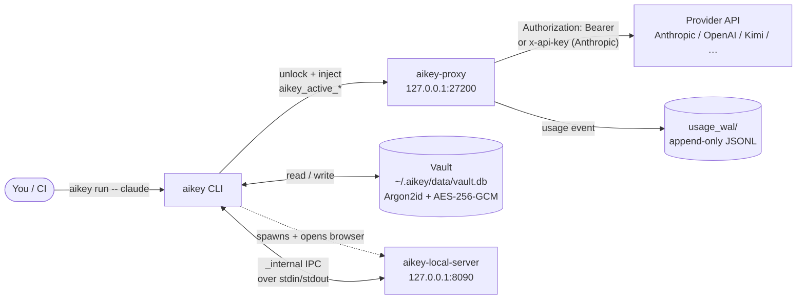
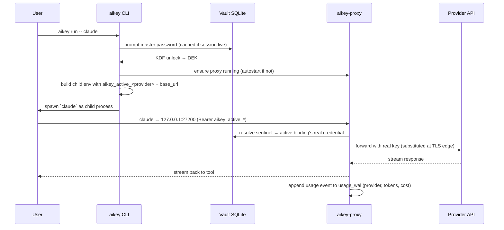

# AiKey CLI

> 🌐 **English** | [中文](./README.zh.md)

[](https://crates.io/crates/aikeylabs-aikey-cli)
[](LICENSE)
[](https://github.com/aikeylabs/launch/issues)
[](https://github.com/aikeylabs)

**FinOps & AI governance for AI provider keys.** Encrypted local vault for your Claude / Codex / Kimi / OpenAI keys + OAuth accounts. Routes every AI request through a local proxy you control — so cost, routing, and audit stay on your machine, and tools see only revocable route tokens instead of real provider keys.

## Who this is for

| You're a... | Jump to |
|---|---|
| **Developer** who wants to use AI tools without pasting real keys into project files | [Quick start](#7-quick-start) → [Usage examples](#9-usage-examples) |
| **Team / FinOps evaluator** assessing if AiKey fits your governance model | [Responsibilities](#1-responsibilities) → [Architecture](#2-architecture) → [Tech stack](#5-tech-stack--why) |
| **Contributor** considering a PR or downstream integration | [Project structure](#11-project-structure) → [Data flow](#4-data-flow) → [Error codes](#10-error-codes) |

---

## 1. Responsibilities

**Does**

- Store API keys + provider OAuth tokens in a local SQLite vault, encrypted with Argon2id + AES-256-GCM.
- Issue revocable **route tokens** (`aikey_personal_<64-hex>` / `aikey_team_<vk_id>` / `aikey_active_<provider>`) that route through `aikey-proxy` to upstream providers.
- Inject credentials at runtime via `aikey run -- <cmd>` or shell hook — no env var pollution outside the child process.
- Track per-key / per-provider usage; surface cost receipts after each session.
- Open the local Vault Web UI (`aikey web`) served by `aikey-local-server`.

**Does NOT**

- Export plaintext secrets to files, env vars, or stdout (no `aikey export`, no eval-style injection).
- Sync vault to cloud by default. The vault is **device-local**; cross-device migration is explicitly out of scope.
- Replace your provider account. AiKey is a **runtime credential layer** — keys still belong to your providers.
- Send telemetry from local CLI invocations. The `aikeylabs.com` install wrapper does send anonymous install events; unset `AIKEY_TELEMETRY_TOKEN` to disable.

**Sibling components** (each has its own repo, all under [github.com/aikeylabs](https://github.com/aikeylabs))

- [`aikey-proxy`](https://github.com/aikeylabs/aikey-proxy) — Local HTTP proxy. Resolves route tokens → real credentials at the egress edge.
- [`aikey-local-server`](https://github.com/aikeylabs/aikey-local-server) — Local web server backing `aikey web` (Vault UI + cost dashboard).

## 2. Architecture



**Why this shape**: the CLI never sees the real provider key after vault unlock — `aikey-proxy` does the substitution at the TLS-edge HTTP boundary. Tools see only a stable route token; rotating the real key behind the vault entry does not touch any tool config.

The web UI doesn't talk to vault directly. It calls `aikey-local-server`, which spawns the CLI in subprocess mode (`aikey _internal vault-op …`) — so Web and CLI go through the **same Rust code path** for every vault mutation. No drift between "what CLI does" and "what web does".

## 3. Call Sequence — `aikey run -- claude`



Vault is unlocked once per shell session — subsequent `aikey run` calls reuse the cached DEK until session timeout. Subsequent runs in other shells share nothing (no cross-shell leak).

## 4. Data Flow

| Command | Reads | Writes | Downstream consumer |
|---|---|---|---|
| `aikey add <alias>` | vault.db (alias uniqueness) | vault.db (encrypted entry) | proxy on next request |
| `aikey auth login <provider>` | OAuth callback over loopback | vault.db (provider_account row + OAuth token) | proxy on next request |
| `aikey use <alias>` | vault.db | `~/.aikey/active.env` + provider bindings | shell hook / `aikey run` env injection |
| `aikey run -- <cmd>` | vault.db (active binding) | child process env only | child process |
| `aikey app authorize <slug>` | vault.db | vault.db (app_record row + scoped binding) | third-party app via `aikey_app_<64-hex>` |
| `aikey route` | vault.db (read-only) | nothing | stdout (for copying into third-party tool config) |
| `aikey test [<alias>]` | vault.db | nothing (probe-only via `X-Aikey-Probe: 1`) | proxy → upstream `/v1/models` |
| `aikey web [page]` | nothing | nothing | spawns browser → `aikey-local-server` |
| `aikey doctor` | edition, proxy, vault, hooks, plugins (trust-local / compliance); `--last-errors` reads the proxy's local recent-error ring | nothing | stdout report (`--detail` adds edition-aware ODS panels; `--last-errors` renders origin, hops, trace ID, and upstream request ID) |
| `aikey audit status` | collector completeness endpoint (+ proxy local state) | nothing | stdout per-source delivery report |
| `aikey audit reconcile` | collector gaps + proxy WAL | known-loss ledger (server) | stdout verdict; re-sends recoverable gaps, confirms losses |

Real credentials never leave `vault.db` except as the substituted upstream auth header inside the proxy → provider call. Probe traffic carries `X-Aikey-Probe: 1` so it does not pollute usage receipts.

## 5. Tech Stack & Why

| Layer | Choice | Why |
|---|---|---|
| Language | Rust 2021 | Single static binary, no runtime dep on host; memory-safe key handling |
| CLI parsing | `clap` v4 derive | Declarative; auto `--help`; subcommand aliases (`ls`, `browse`) |
| Storage | SQLite via `rusqlite` (`bundled`) | Zero install footprint; no service required; file is portable |
| Password KDF | Argon2id, **m=64 MiB, t=3, p=4** ([crypto.rs:24](src/crypto.rs)) | OWASP-recommended; resists GPU attacks |
| Symmetric crypto | AES-256-GCM ([crypto.rs:9](src/crypto.rs)) | AEAD, authenticated; NIST-approved |
| Memory hygiene | `secrecy` + `zeroize` | Sensitive bytes wiped on drop; never logged via `Debug` |
| OAuth | provider-specific in `commands_auth/` | Native OAuth 2.0 + PKCE; no third-party broker; broker runs locally |
| Password prompt | `rpassword` | TTY echo-off; works in restricted shells |
| IPC (CLI ↔ local-server) | JSON envelope over stdin/stdout (`_internal vault-op`) | One Rust code path for vault writes whether CLI- or web-triggered |

**Pinned decision**: `rusqlite` with `bundled` means SQLite is statically linked. Trade-off is +1.5 MB binary size for zero host-SQLite version variance.

## 6. Runtime Environment

| Item | Requirement |
|---|---|
| OS | macOS 12+ / Linux (Ubuntu 20.04+, CentOS 8+, Alpine 3.16+) / Windows 10+ |
| Architecture | x86_64 / arm64 |
| Runtime deps | **None** (single static binary) |
| Disk | ~30 MB binary + vault grows ~1 KB per credential |
| Network | Outbound to provider APIs only; proxy binds `127.0.0.1:27200` (loopback) |

**Filesystem layout** (`$AIKEY_HOME`, default `~/.aikey/`)

```
~/.aikey/
├── bin/                # aikey, aikey-proxy, ak (symlink), [aikey-local-server]
├── config/             # rendered service configs (aikey-proxy.yaml, etc.)
├── data/
│   └── vault.db        # encrypted SQLite, file mode 0600
├── logs/               # CLI + proxy logs (rotated)
├── active.env          # current `aikey use` selections (per-provider)
├── identity            # anonymous local installer UUID
├── hook.sh             # sourced from your shell rc when hook is installed
├── uninstall.sh        # full cleanup script, run with --yes
└── backups/            # automatic vault snapshots before destructive ops
```

**Default ports**: `127.0.0.1:27200` (proxy) and `127.0.0.1:8090` (local-server / web UI). Override via `AIKEY_PROXY_PORT` / `CONSOLE_PORT` env.

## 7. Quick Start

```bash
# 1. Install (auto-detects OS, installs to ~/.aikey/)
curl -fsSL https://aikeylabs.com/zh/i/of | sh

# 2. Re-source your shell so PATH picks up the binary
source ~/.zshrc      # or ~/.bashrc

# 3. Add your first key — vault auto-initializes, prompts for master password
aikey add my-claude --provider anthropic

# 4. Activate the key for the anthropic provider
aikey use my-claude

# 5. Run a tool through aikey (proxy autostarts if needed)
aikey run -- claude
```

After step 5, `claude` talks to `127.0.0.1:27200`, which substitutes your route token for the real Anthropic key. A cost receipt prints when the session exits.

For OAuth (Claude Pro/Max, ChatGPT Plus, Kimi Code) instead of API key: `aikey auth login claude` (or `codex` / `kimi`).

## 8. Startup Notes

What auto-fires on first launch (and why):

| Trigger | What happens | Why |
|---|---|---|
| First `aikey <any-command>` | Vault auto-init at `~/.aikey/data/vault.db`; prompts master password | Avoid a manual `aikey vault init` ceremony |
| First `aikey run` per shell | `aikey-proxy` autostarts on `127.0.0.1:27200` if not running | Tool invocations don't fail with "proxy not up" |
| First install | `~/.aikey/identity` generated (anonymous UUID) | Anonymous install correlation only; not tied to email |
| `aikey hook install` | Appends 1 line to `~/.zshrc` / `~/.bashrc` | Future terminals load `active.env` so `claude` "just works" without `aikey run` |
| Vault unlock | DEK cached in memory for the shell session | Avoid re-prompting password for every command |

> **Reset / forget**: delete `~/.aikey/identity` to regenerate the installer ID. Run `~/.aikey/uninstall.sh --yes` for full cleanup (irreversible — automatic backup is taken first in `~/.aikey/backups/`).

## 9. Usage Examples

```bash
# Inventory
aikey list                                  # or `aikey ls`
aikey route                                 # third-party client integration map
aikey whoami                                # current active key + identity

# Add credentials
aikey add my-claude --provider anthropic    # single key via prompt
aikey auth login claude                     # OAuth account (Pro/Max)
aikey import ~/keys.txt                     # bulk import via browser confirmation

# Activation
aikey use my-claude                         # global active (persists to active.env)
aikey activate my-claude                    # current shell only (temporary)
aikey deactivate                            # restore previous global state
aikey unuse anthropic                       # clear active for one provider

# Run tools
aikey run -- claude                         # one-shot through proxy
aikey run -- python eval.py                 # works with any tool reading provider env

# Third-party apps (issue a scoped app bearer)
aikey app authorize my-cursor               # → prints OPENAI_BASE_URL + app bearer
aikey app revoke my-cursor                  # immediate revocation

# Web Vault UI
aikey web                                   # opens local console (default page)
aikey web usage                             # jump straight to Usage page
aikey web vault                             # jump straight to Vault page

# Display time zone (Web and CLI presentation only)
aikey config time-zone Asia/Shanghai        # Beijing / Shanghai, China Standard Time
aikey config time-zone auto                 # follow this device's system time zone
aikey config time-zone --json               # inspect the effective preference

# Maintenance
aikey doctor                                # diagnose PATH / hook / proxy / vault
aikey doctor --last-errors                  # explain recent proxy errors as a caused-by tree (local state only)
aikey test --all                            # connectivity test all credentials
aikey proxy restart                         # restart the local proxy

# Service status (which daemons are up)
aikey service status                        # one line each: web / proxy / trust-local
aikey web status                            # local web console: running? port? vault state?
aikey proxy status                          # proxy: running? pid? listen addr?
aikey service status trust-local            # a single service in detail

# Delivery audit (financial-grade usage completeness)
aikey audit status                          # per-source: allocated / confirmed / gaps / known-loss / quarantine
aikey audit reconcile                       # actively reconcile now: re-send recoverable gaps, confirm true losses
```

Run `aikey --help` for the full subcommand list (alphabetical, with a "Frequently used" shortcut section at the end).

## 10. Error Codes

CLI errors return a structured `error_code` (mirrored in `_internal` IPC and `aikey-local-server` API responses). [`src/error_codes.rs`](src/error_codes.rs) is the source of truth; the table below is the **stable user-facing subset**.

| Code | When | Next step |
|---|---|---|
| `ALIAS_EXISTS` | `aikey add <alias>` collides with existing | Use a different alias or `aikey remove <alias>` first |
| `ALIAS_NOT_FOUND` | `aikey use / activate / run` references unknown alias | `aikey list` to see what's available |
| `VAULT_LOCKED` | Operation needs master password but session expired | Re-run command, enter master password when prompted |
| `VAULT_NOT_INITIALIZED` | First-time vault file missing | Run any `aikey` command; auto-init prompts |
| `NO_ACTIVE_PROFILE` | `aikey run` invoked without `aikey use` first | `aikey use <alias>` to select a key |
| `INVALID_INPUT` | Argument shape wrong (e.g. unknown provider name) | Check `aikey <subcmd> --help` |
| `PROXY_TOO_OLD_NO_PROBE_RAW` | New CLI hits old `aikey-proxy` that lacks pre-save probe support | `aikey service restart proxy` after upgrading |
| `TOKEN_INVALID` | Malformed `aikey_*` token sent to proxy | Run `aikey route` to see valid tokens |
| `TIMEOUT` | Proxy / provider didn't respond | `aikey doctor`; check outbound network |
| `IO_ERROR` | Filesystem / network unexpected error | Check disk space, perms (`~/.aikey/` must be 0700) |

`_internal` IPC codes (prefix `I_*`, used between CLI and `aikey-local-server`) — full table in [docs/VAULT_SPEC.md](docs/VAULT_SPEC.md); they appear only in `aikey-local-server` logs.

## 11. Project Structure

```
aikey-cli/
├── src/
│   ├── main.rs                   # entry + global error handling
│   ├── lib.rs                    # public API for aikey-sdk / aikey-local-server
│   ├── cli.rs                    # clap definitions (all subcommands)
│   ├── storage.rs                # vault SQLite open / migrate / query
│   ├── crypto.rs                 # Argon2id KDF + AES-256-GCM AEAD
│   ├── error_codes.rs            # central error enum (source of truth)
│   ├── observability.rs          # event names + structured logging
│   ├── audit.rs                  # audit log writer
│   ├── executor.rs               # `aikey run` child-process spawning
│   ├── platform_client.rs        # CLI ↔ remote control server RPCs
│   ├── connectivity/             # probe pipeline (per-provider /v1/models)
│   ├── commands_account/         # account / `use` / lifecycle pipeline
│   ├── commands_auth/            # OAuth flows (Claude / Codex / Kimi)
│   ├── commands_app/             # third-party app integration (`aikey app authorize`)
│   ├── commands_internal/        # `_internal vault-op` (IPC from local-server)
│   ├── commands_proxy.rs         # proxy lifecycle (start / stop / restart)
│   ├── commands_statusline.rs    # shell statusline integration
│   ├── commands_watch.rs         # watch mode for usage events
│   └── (more: env, import, init, project, ...)
├── aikey-sdk/                    # reusable lib crate (used by other Rust callers)
├── docs/                         # VAULT_SPEC.md + cli-platform-contract.md
├── scripts/                      # one-off probes (kimi / statusline / e2e dashboards)
├── tests/                        # integration tests
└── Cargo.toml                    # workspace root
```

## 12. Links

- 🐛 **Issues / feature requests**: https://github.com/aikeylabs/launch/issues
- 📖 **Vault spec (deep dive)**: [docs/VAULT_SPEC.md](docs/VAULT_SPEC.md)
- 🔌 **CLI platform contract**: [docs/cli-platform-contract.md](docs/cli-platform-contract.md)
- 🤝 **Contributing**: [CONTRIBUTING.md](CONTRIBUTING.md)
- 🔒 **Security policy**: [SECURITY.md](SECURITY.md)
- 🌐 **Main site**: https://aikeylabs.com
- 📦 **All source repos**: https://github.com/aikeylabs

---

**License**: Apache-2.0 © AiKey Labs. See [LICENSE](LICENSE).
