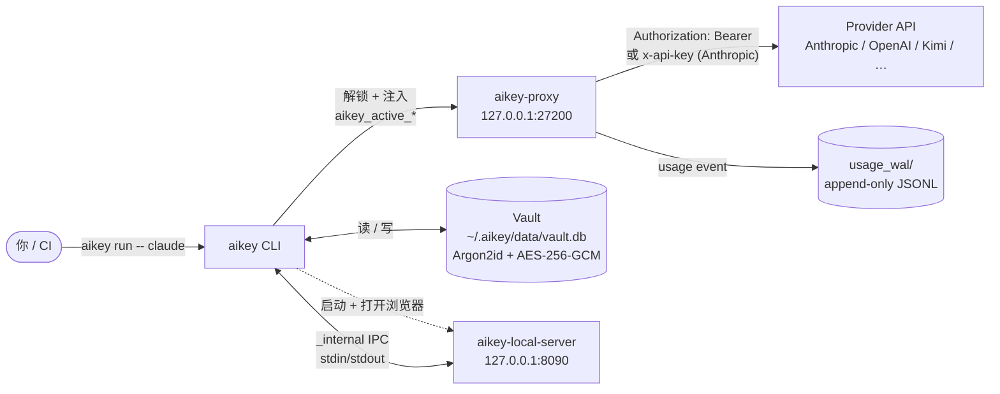
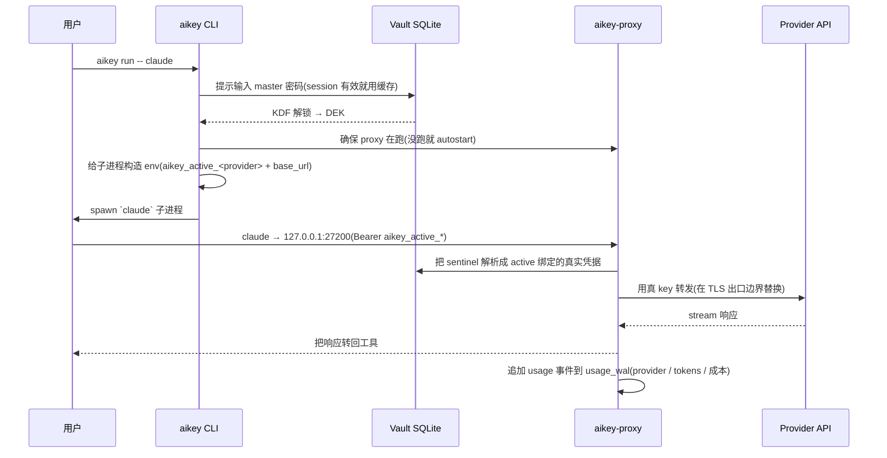

# AiKey CLI

> 🌐 **中文** | [English](./README.md)

[](https://crates.io/crates/aikeylabs-aikey-cli)
[](LICENSE)
[](https://github.com/aikeylabs/launch/issues)
[](https://github.com/aikeylabs)

**面向开发者的 AI Key 治理与 FinOps 工作台。** 在本地加密 Vault 中保管 Claude / Codex / Kimi / OpenAI 的 API Key 和 OAuth 账号,每一次 AI 调用都通过你自己机器上的本地 Proxy — 成本、路由、审计都留在本机,工具拿到的只是可吊销的 route token,而不是真实 provider key。

## 这份文档给谁看

| 你是... | 直接跳到 |
|---|---|
| **开发者** — 想用 AI 工具但不愿把真实 key 写进项目文件 | [快速开始](#7-快速开始) → [使用示例](#9-使用示例) |
| **团队 / FinOps 评估者** — 在评估 AiKey 是否符合治理模型 | [职责](#1-职责) → [架构](#2-架构) → [技术栈选型](#5-技术栈选型--为什么) |
| **贡献者 / 下游集成方** — 在考虑 PR 或基于 AiKey 做集成 | [项目结构](#11-项目结构) → [数据流](#4-数据流) → [错误码](#10-错误码) |

---

## 1. 职责

**做什么**

- 把 API Key + provider OAuth token 存到本地 SQLite vault,Argon2id + AES-256-GCM 加密。
- 签发可吊销的 **route token**(`aikey_personal_<64-hex>` / `aikey_team_<vk_id>` / `aikey_active_<provider>`),通过 `aikey-proxy` 路由到上游 provider。
- 运行时通过 `aikey run -- <cmd>` 或 shell hook 注入凭据 — 不污染子进程之外的 env 变量。
- 跟踪 per-key / per-provider 用量,会话结束打印成本小票。
- 打开本地 Vault Web UI(`aikey web`),后端是 `aikey-local-server`。

**不做什么**

- 不导出明文 secrets 到文件、env var 或 stdout(没有 `aikey export`,没有 eval 风格的注入)。
- 默认不同步 vault 到云。Vault 是 **设备本地** 的;跨设备迁移目前明确不在 scope 内。
- 不替代你的 provider 账号。AiKey 是 **运行时凭据层** — key 还是属于你的 provider。
- 本地 CLI 调用不发 telemetry。`aikeylabs.com` 安装 wrapper 会发匿名安装事件;`unset AIKEY_TELEMETRY_TOKEN` 关掉。

**兄弟组件**(各自独立 repo,都在 [github.com/aikeylabs](https://github.com/aikeylabs))

- [`aikey-proxy`](https://github.com/aikeylabs/aikey-proxy) — 本地 HTTP proxy。在出口边界把 route token 换成真实凭据。
- [`aikey-local-server`](https://github.com/aikeylabs/aikey-local-server) — 本地 web server,后端服务 `aikey web`(Vault UI + 成本仪表盘)。

## 2. 架构



**为什么这样设计**:vault 解锁后,CLI 自己不再持有真 provider key — 替换发生在 `aikey-proxy` 的 TLS 出口边界。工具看到的永远是稳定的 route token;真 key 在 vault 内被换掉,工具配置一行不用动。

Web UI 不直接访问 vault。它调 `aikey-local-server`,后者用子进程模式启 CLI(`aikey _internal vault-op …`)— 所以 Web 写盘和 CLI 写盘 **走同一份 Rust 代码**。"CLI 做的事"和"web 做的事"不会漂移。

## 3. 调用时序 — `aikey run -- claude`



Vault 每个 shell session 只解锁一次 — 后续的 `aikey run` 用缓存的 DEK,直到 session 超时。别的 shell 不共享(无跨 shell 泄露)。

## 4. 数据流

| 命令 | 读 | 写 | 下游消费者 |
|---|---|---|---|
| `aikey add <alias>` | vault.db(alias 唯一性) | vault.db(加密 entry) | 下次请求时 proxy |
| `aikey auth login <provider>` | OAuth callback via loopback | vault.db(provider_account 行 + OAuth token) | 下次请求时 proxy |
| `aikey use <alias>` | vault.db | `~/.aikey/active.env` + provider 绑定 | shell hook / `aikey run` env 注入 |
| `aikey run -- <cmd>` | vault.db(active binding) | 仅子进程 env | 子进程 |
| `aikey app authorize <slug>` | vault.db | vault.db(app_record 行 + scoped binding) | 第三方 app 通过 `aikey_app_<64-hex>` |
| `aikey route` | vault.db(read-only) | 无 | stdout(可复制到第三方工具配置) |
| `aikey test [<alias>]` | vault.db | 无(probe-only,带 `X-Aikey-Probe: 1`) | proxy → upstream `/v1/models` |
| `aikey web [page]` | 无 | 无 | spawn 浏览器 → `aikey-local-server` |
| `aikey doctor` | 版型 / proxy / vault / hooks / 插件(trust-local / 合规过滤)；`--last-errors` 读取 proxy 本地最近错误环形缓冲 | 交互模式自动修复：重启已停的 proxy、启动已停的 local-server 和 trust-local 守护进程、安装缺失的 shell hook（`--json` 时只读） | stdout 诊断报告（`--detail` 增加按版型区分的 ODS 面板；`--last-errors` 显示产地、途经链、trace ID 与上游 request ID） |
| `aikey audit status` | collector completeness 端点（+ proxy 本地状态：用量 WAL/死信 **和**合规上报队列）| 无 | stdout per-source 投递报告 + 本地投递通道 |
| `aikey audit reconcile` | collector 缺口 + proxy WAL | 已知丢失台账（服务端）| stdout 对账结论；补传可恢复缺口、确认丢失 |

真凭据除了在 proxy → provider 调用里被替换成上游 auth header 之外,**从不离开** vault.db。Probe 流量带 `X-Aikey-Probe: 1`,不会污染用量小票。

## 5. 技术栈选型 — 为什么

| 层 | 选择 | 为什么 |
|---|---|---|
| 语言 | Rust 2021 | 单一静态二进制,无 host 运行时依赖;内存安全,凭据处理类型安全 |
| CLI 解析 | `clap` v4 derive | 声明式;自动生成 `--help`;子命令别名(`ls`、`browse`) |
| 存储 | SQLite via `rusqlite`(`bundled`) | 零安装足迹;不需要服务进程;文件可移植 |
| 密码 KDF | Argon2id,**m=64 MiB, t=3, p=4**([crypto.rs:24](src/crypto.rs)) | OWASP 推荐;抗 GPU 攻击 |
| 对称加密 | AES-256-GCM([crypto.rs:9](src/crypto.rs)) | AEAD,带认证;NIST 标准 |
| 内存卫生 | `secrecy` + `zeroize` | 敏感字节 drop 时清零;不会被 `Debug` 日志泄露 |
| OAuth | 各 provider 独立实现在 `commands_auth/` | 原生 OAuth 2.0 + PKCE;不依赖第三方 broker;broker 跑本地 |
| 密码 prompt | `rpassword` | TTY 关回显;在受限 shell 也能工作 |
| IPC(CLI ↔ local-server)| JSON envelope 走 stdin/stdout(`_internal vault-op`)| CLI 触发还是 web 触发,vault 写盘走同一份 Rust 代码 |

**钉死的决策**:`rusqlite` 用 `bundled` 静态链接 SQLite。代价是二进制 +1.5 MB,换回的是 host SQLite 版本差异为零。

## 6. 运行环境

| 项 | 要求 |
|---|---|
| OS | macOS 12+ / Linux(Ubuntu 20.04+ / CentOS 8+ / Alpine 3.16+)/ Windows 10+ |
| 架构 | x86_64 / arm64 |
| 运行时依赖 | **无**(单一静态二进制) |
| 磁盘 | ~30 MB 二进制 + vault 每条凭据约 1 KB |
| 网络 | 仅出向 provider API;proxy 绑 `127.0.0.1:27200`(loopback) |

**文件系统布局**(`$AIKEY_HOME`,默认 `~/.aikey/`)

```
~/.aikey/
├── bin/                # aikey、aikey-proxy、ak(软链)、[aikey-local-server]
├── config/             # 渲染后的 service 配置(aikey-proxy.yaml 等)
├── data/
│   └── vault.db        # 加密 SQLite,文件权限 0600
├── logs/               # CLI + proxy 日志(轮转)
├── active.env          # 当前 `aikey use` 选择(per-provider)
├── identity            # 匿名本地安装 UUID
├── hook.sh             # 安装 hook 后从 shell rc source
├── uninstall.sh        # 完整清理脚本,用 --yes 跑
└── backups/            # 破坏性操作前的 vault 自动快照
```

**默认端口**:`127.0.0.1:27200`(proxy)和 `127.0.0.1:8090`(local-server / web UI)。可通过 `AIKEY_PROXY_PORT` / `CONSOLE_PORT` env 覆盖。

## 7. 快速开始

```bash
# 1. 安装(自动检测 OS,装到 ~/.aikey/)
curl -fsSL https://aikeylabs.com/zh/i/of | sh

# 2. 重新 source shell 让 PATH 生效
source ~/.zshrc      # 或 ~/.bashrc

# 3. 加第一把 key — vault 自动初始化,提示设置 master 密码
aikey add my-claude --provider anthropic

# 4. 把这把 key 设为 anthropic 的 active 绑定
aikey use my-claude

# 5. 通过 aikey 跑工具(proxy 没起会自动起)
aikey run -- claude
```

第 5 步之后,`claude` 跟 `127.0.0.1:27200` 通信,proxy 把你的 route token 换成真 Anthropic key 转上去。会话退出时会打成本小票。

想用 OAuth(Claude Pro/Max、ChatGPT Plus、Kimi Code)而不是 API key:`aikey auth login claude`(或 `codex` / `kimi`)。

## 8. 首次启动会发生什么

第一次跑会自动做以下事(以及为什么):

| 触发 | 发生什么 | 为什么 |
|---|---|---|
| 第一次任意 `aikey <cmd>` | Vault 自动初始化到 `~/.aikey/data/vault.db`,提示设置 master 密码 | 避免手动 `aikey vault init` 仪式 |
| 每个 shell 第一次 `aikey run` | `aikey-proxy` 没跑就 autostart 到 `127.0.0.1:27200` | 工具调用不会因为 "proxy 没起" 失败 |
| 第一次安装 | 生成 `~/.aikey/identity`(匿名 UUID) | 仅用于安装事件匿名关联;跟邮箱不挂钩 |
| `aikey hook install` | 给 `~/.zshrc` / `~/.bashrc` 追加 1 行 | 之后开新终端会自动 load `active.env`,`claude` 直接就能用,不需要 `aikey run` |
| Vault 解锁 | DEK 缓存到 shell session 的内存里 | 每条命令不用反复输密码 |

> **重置 / 忘掉**:删 `~/.aikey/identity` 重生成安装 ID;跑 `~/.aikey/uninstall.sh --yes` 完整清理(不可逆 — 但会先在 `~/.aikey/backups/` 自动备份)。

## 9. 使用示例

```bash
# 看清单
aikey list                                  # 或 `aikey ls`
aikey route                                 # 第三方工具集成清单(可复制贴到工具配置)
aikey whoami                                # 当前 active key + identity

# 加凭据
aikey add my-claude --provider anthropic    # 单把 key,交互式输入
aikey auth login claude                     # OAuth 账号(Pro/Max)
aikey import ~/keys.txt                     # 批量导入,通过浏览器确认

# 激活
aikey use my-claude                         # 全局 active(写到 active.env)
aikey activate my-claude                    # 仅当前 shell(临时)
aikey deactivate                            # 恢复之前全局状态
aikey unuse anthropic                       # 清掉某 provider 的 active

# 跑工具
aikey run -- claude                         # 一次性通过 proxy
aikey run -- python eval.py                 # 任何读 provider env 的工具都行

# 第三方 app(签发 scoped app bearer)
aikey app authorize my-cursor               # → 打印 OPENAI_BASE_URL + app bearer
aikey app revoke my-cursor                  # 立即吊销

# Web Vault UI
aikey web                                   # 打开本地控制台(默认页)
aikey web usage                             # 直接跳到 Usage 页
aikey web vault                             # 直接跳到 Vault 页

# 显示时区（仅影响 Web 和 CLI 的显示）
aikey config time-zone Asia/Shanghai        # 北京 / 上海，中国标准时间
aikey config time-zone auto                 # 跟随本设备系统时区
aikey config time-zone --json               # 查看当前偏好

# 维护
aikey doctor                                # 诊断 PATH / hook / proxy / vault
aikey doctor --last-errors                  # 用 caused-by 树解释最近 proxy 错误（仅读本地状态）
aikey test --all                            # 连通性测试所有凭据
aikey proxy restart                         # 重启 local proxy

# 服务状态(哪些后台进程在运行)
aikey service status                        # 一行一个: web / proxy / trust-local
aikey web status                            # 本地 web 控制台: 是否运行? 端口? vault 状态?
aikey proxy status                          # proxy: 是否运行? pid? 监听地址?
aikey service status trust-local            # 单个服务的详细状态

# 一并启停(`all` = 全部已安装服务)
aikey service start all                     # 一起拉起 proxy + web + trust-local(跳过未安装/已在跑)
aikey service stop all                      # 停掉所有在运行的服务
aikey service restart all                   # 重启每个已安装服务

# 投递审计（财务对账级用量完整性）
aikey audit status                          # 按源看：已分配 / 已确认 / 缺口 / 已知丢失 / 隔离
                                            # 同时显示本地合规上报队列（尚未送达的审计记录）
aikey audit reconcile                       # 立即主动对账：补传可恢复缺口、确认真实丢失
aikey proxy replay-dead-letter              # 排除故障后，把队列里积压的（用量 + 合规）重新投递出去
```

`aikey audit status` 末尾会显示 proxy 的两条本地投递通道。**合规**那一行是 Production /
Cluster 上要盯的：队列非空 = 有审计记录还**没有**送达控制台（Control Panel）——它们是
**延迟**不是丢失，排除原因后用 `aikey proxy replay-dead-letter` 就能补投。那里出现
`HTTP 400` 是**版本漂移**的典型特征（控制台比这台 proxy 旧，严格解码直接拒收），
需要先升级服务端。如果这一行显示 `not reported by this proxy (older build)`，说明队列是
**没被监控**而不是空的 —— 需要升级这台机器上的 aikey。

`aikey --help` 看全部子命令(按字母序排列,末尾附「Frequently used」高频命令快捷区)。

## 10. 错误码

CLI 错误返回结构化 `error_code`(IPC 内部和 `aikey-local-server` API 响应里也镜像)。[`src/error_codes.rs`](src/error_codes.rs) 是真相源;下表是 **面向用户的稳定子集**。

| Code | 何时触发 | 下一步 |
|---|---|---|
| `ALIAS_EXISTS` | `aikey add <alias>` 跟已有的撞了 | 换个 alias,或先 `aikey remove <alias>` |
| `ALIAS_NOT_FOUND` | `aikey use / activate / run` 引用未知 alias | `aikey list` 看有哪些 |
| `VAULT_LOCKED` | 操作需要 master 密码但 session 过期 | 重跑命令,提示时输入 master 密码 |
| `VAULT_NOT_INITIALIZED` | 首次跑 vault 文件不在 | 跑任意 `aikey` 命令,自动初始化会提示 |
| `NO_ACTIVE_PROFILE` | `aikey run` 之前没跑过 `aikey use` | `aikey use <alias>` 选一把 |
| `INVALID_INPUT` | 参数形态不对(比如未知 provider 名)| 看 `aikey <subcmd> --help` |
| `PROXY_TOO_OLD_NO_PROBE_RAW` | 新 CLI 命中老 `aikey-proxy`,不支持 pre-save probe | 升级 aikey 后 `aikey service restart proxy` |
| `TOKEN_INVALID` | 发给 proxy 的 `aikey_*` token 形态错 | `aikey route` 看合法 token |
| `TIMEOUT` | proxy / provider 没响应 | `aikey doctor`;查出口网络 |
| `IO_ERROR` | 文件 / 网络意外错误 | 查磁盘空间和权限(`~/.aikey/` 必须 0700) |

`_internal` IPC 错误码(前缀 `I_*`,CLI ↔ `aikey-local-server` 之间用)— 完整表见 [docs/VAULT_SPEC.md](docs/VAULT_SPEC.md);只会在 `aikey-local-server` 日志里看到。

## 11. 项目结构

```
aikey-cli/
├── src/
│   ├── main.rs                   # 入口 + 全局错误处理
│   ├── lib.rs                    # 给 aikey-sdk / aikey-local-server 的 public API
│   ├── cli.rs                    # clap 定义(所有子命令)
│   ├── storage.rs                # vault SQLite 打开 / migrate / 查询
│   ├── crypto.rs                 # Argon2id KDF + AES-256-GCM AEAD
│   ├── error_codes.rs            # 中央错误 enum(真相源)
│   ├── observability.rs          # 事件名 + 结构化日志
│   ├── audit.rs                  # 审计日志 writer
│   ├── executor.rs               # `aikey run` 子进程启动
│   ├── platform_client.rs        # CLI ↔ 远程 control server RPC
│   ├── connectivity/             # probe pipeline(per-provider /v1/models)
│   ├── commands_account/         # account / `use` / lifecycle pipeline
│   ├── commands_auth/            # OAuth flows(Claude / Codex / Kimi)
│   ├── commands_app/             # 第三方 app 集成(`aikey app authorize`)
│   ├── commands_internal/        # `_internal vault-op`(local-server 调过来的 IPC)
│   ├── commands_proxy.rs         # proxy 生命周期(start / stop / restart)
│   ├── commands_statusline.rs    # shell statusline 集成
│   ├── commands_watch.rs         # usage 事件的 watch 模式
│   └── (其他:env、import、init、project ...)
├── aikey-sdk/                    # 可复用的 lib crate(其他 Rust caller 用)
├── docs/                         # VAULT_SPEC.md + cli-platform-contract.md
├── scripts/                      # 一次性 probe 脚本(kimi / statusline / e2e 仪表盘)
├── tests/                        # 集成测试
└── Cargo.toml                    # workspace 根
```

## 12. 链接

- 🐛 **Issues / 需求**:https://github.com/aikeylabs/launch/issues
- 📖 **Vault spec(深入)**:[docs/VAULT_SPEC.md](docs/VAULT_SPEC.md)
- 🔌 **CLI 平台契约**:[docs/cli-platform-contract.md](docs/cli-platform-contract.md)
- 🤝 **贡献指南**:[CONTRIBUTING.md](CONTRIBUTING.md)
- 🔒 **安全策略**:[SECURITY.md](SECURITY.md)
- 🌐 **主站**:https://aikeylabs.com
- 📦 **所有源码 repo**:https://github.com/aikeylabs

---

**许可证**:Apache-2.0 © AiKey Labs. 见 [LICENSE](LICENSE)。
