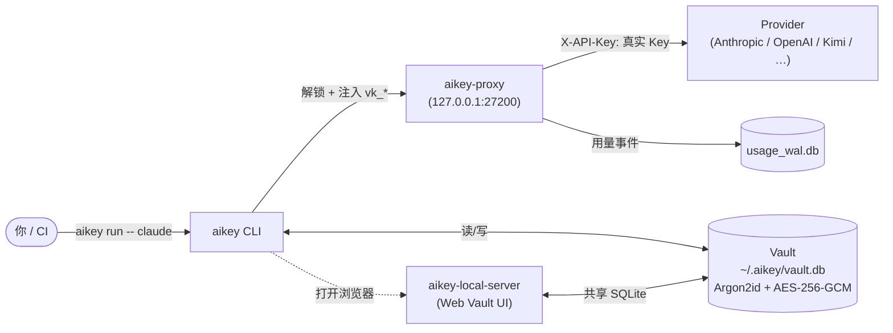
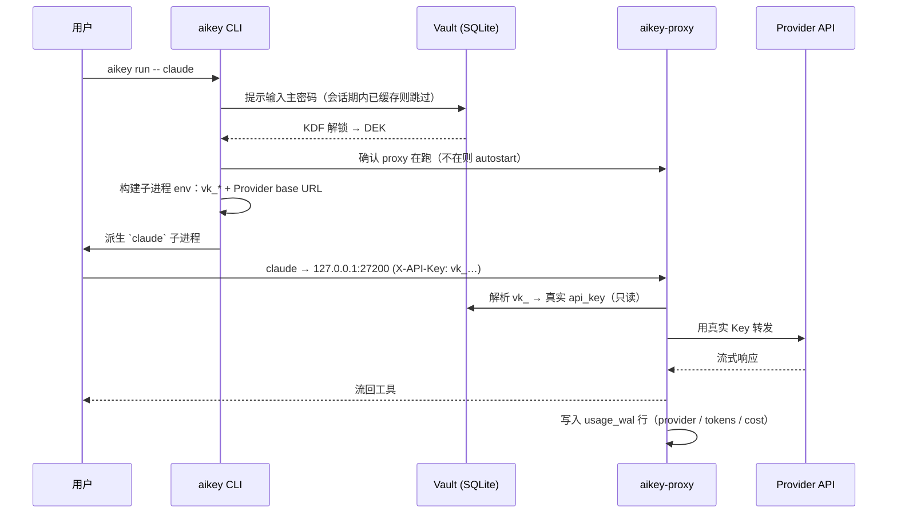

# AiKey CLI

> 🌐 **中文** | [English](./README.md)

[](https://crates.io/crates/aikeylabs-aikey-cli)
[](LICENSE)
[](https://github.com/aikeylabs/launch/issues)

**本地优先的安全凭证保险箱 + AI 工具运行时路由。** 把 API Key 和 Provider OAuth 账号收进加密的本地 vault，给日常工具（Claude / Codex / Kimi 等）下发**可撤销的虚拟 Key**，并按 Key / Provider 观测用量 —— 全程不需要把真实凭证粘到项目文件或环境变量里。

## 1. 职责

**做什么**

- 把 API Key + Provider OAuth token 存进本地 SQLite vault，用 Argon2id + AES-256-GCM 加密。
- 签发可撤销的 **虚拟 Key**（`aikey_vk_*`），通过 `aikey-proxy` 路由到上游 Provider。
- 运行时注入凭证：`aikey run -- <cmd>` 或 shell hook —— 子进程之外不污染环境变量。
- 按 Key / Provider 追踪用量，会话结束打印费用小票。
- 通过 `aikey web` 打开本地 Vault Web UI（由 `aikey-local-server` 提供服务）。

**不做什么**

- 不导出明文密钥到文件、环境变量或 stdout（没有 `aikey export`，没有 eval 注入风格的命令）。
- 默认不做 vault 云同步。Vault 是**单机本地**的；跨设备迁移**明确不在 scope 内**，后续再议。
- 不替代你的 Provider 账号。AiKey 是**运行时凭证层** —— Key 的所有权仍属于你的 Provider。

**配套组件**（独立仓库）

- [`aikey-proxy`](https://github.com/aikeylabs/aikey-proxy) —— 本地 HTTP/HTTPS 代理，把虚拟 Key 解析为真实 Provider Key 并记用量。
- [`aikey-local-server`](https://github.com/aikeylabs/aikey-local-server) —— 本地 Web 服务，给 `aikey web` 提供 Vault UI。

## 2. 架构图



**为什么这样设计**：vault 解锁后，CLI 本身**也不再持有真实 Provider Key** —— 由 `aikey-proxy` 在 TLS 出口替换。工具只看见稳定的虚拟 Key（`aikey_vk_*`），背后真实 Key 轮换不需要改任何工具配置。

## 3. 调用时序 —— `aikey run -- claude`



每个 shell 会话默认只解锁一次 vault —— 后续 `aikey run` 复用缓存的 DEK，直到会话超时。

## 4. 数据流

| 命令 | 读取 | 写入 | 下游消费方 |
|------|------|------|-----------|
| `aikey add <alias>` | vault.db（别名唯一性） | vault.db（加密块） | proxy 下次请求时使用 |
| `aikey use <alias>` | vault.db | `active_env` 配置文件 | shell hook（env 注入） |
| `aikey run -- <cmd>` | vault.db | 仅子进程 env | 子进程 |
| `aikey import <file>` | 输入文件 | vault.db（批量） | Web UI 确认 |
| `aikey auth login <provider>` | OAuth 回调 | vault.db（token 记录） | proxy 下次请求时使用 |
| `aikey web [page]` | 无 | 无 | 拉起浏览器 → aikey-local-server |
| `aikey hook install` | shell rc (`.zshrc` / `.bashrc`) | shell rc + `~/.aikey/hook.sh` | 每个新终端 |
| `aikey doctor` | proxy 端口、vault 路径、hooks | 无（仅诊断） | stdout 报告 |

真实凭证除了在 proxy → provider 这段被替换成 `X-API-Key` 头之外，**永远不离开 `vault.db`**。

## 5. 技术栈

| 层 | 选择 | 为什么 |
|----|------|--------|
| 语言 | Rust 2021 | 单一静态二进制，宿主无需 runtime；类型系统帮 Key 安全 |
| CLI 解析 | `clap` v4 derive | 声明式；自动 `--help`；支持 `ls`/`browse` 别名 |
| 存储 | SQLite via `rusqlite`（`bundled`） | 零安装；不依赖外部服务；可携带文件 |
| 密码 KDF | Argon2id（m=64 MiB, t=3, p=4） | OWASP 推荐；抗 GPU 攻击 |
| 对称加密 | AES-256-GCM（`aes-gcm`） | AEAD 带认证；NIST 标准 |
| 内存清理 | `secrecy` + `zeroize` | 敏感字节 drop 时清零；不会通过 `Debug` 泄漏到日志 |
| OAuth | `commands_auth/` 下分 provider 实现 | 原生 OAuth 2.0 + PKCE；不走第三方 broker |
| 剪贴板（Magic Add） | `arboard` | 跨平台粘贴检测 |
| 密码输入 | `rpassword` | TTY 关回显；受限 shell 也能跑 |

**钉死的决策**：`rusqlite` 用 `bundled` 把 SQLite 静态链接进去。代价是 +1.5 MB 二进制体积，换来宿主 SQLite 版本零差异。

## 6. 运行环境

| 项 | 要求 |
|----|------|
| OS | macOS 12+ / Linux（Ubuntu 20.04+, CentOS 8+, Alpine 3.16+）/ Windows 10+ |
| 架构 | x86_64 / arm64 |
| 运行时依赖 | **无**（单一静态二进制） |
| 磁盘 | 二进制约 30 MB + vault 每个 Key 约 1 KB |
| 网络 | 仅出方向连 Provider API；proxy 绑 `127.0.0.1:27200`（loopback） |

**文件布局**（`$AIKEY_HOME`，默认 `~/.aikey/`）：

```
~/.aikey/
├── vault.db          # 加密 SQLite（文件权限 0600）
├── identity          # 本机安装匿名 ID（uuid）
├── hook.sh           # 由 shell rc source
├── active_env        # 当前 `aikey use` 选择（per-provider）
├── proxy/            # aikey-proxy 状态（PID 文件 / 日志）
└── backups/          # 破坏性操作前的自动 vault 备份
```

**默认 proxy 端口**：`127.0.0.1:27200`。如有冲突可通过 `AIKEY_PROXY_PORT` env 覆盖。

## 7. 快速开始

```bash
# 1. 安装（自动识别 OS）
curl -fsSL https://aikeylabs.com/zh/i/of | sh

# 2. 重新 source shell，让 PATH 立即生效
source ~/.zshrc                              # 或 ~/.bashrc

# 3. 添加你的第一个 Key（首次会自动初始化 vault，提示设置主密码）
aikey add my-claude --provider anthropic

# 4. 激活
aikey use my-claude

# 5. 通过 aikey 跑工具（proxy 不在跑会 autostart）
aikey run -- claude
```

第 5 步之后，`claude` CLI 实际请求的是 `127.0.0.1:27200`，proxy 在此把你的虚拟 Key 换成真实的 Anthropic Key。会话退出时打印费用小票。

## 8. 启动注意（Startup Notes）

首次运行自动触发的事情（以及为什么）：

| 触发点 | 发生了什么 | 为什么 |
|--------|-----------|--------|
| 第一次执行 `aikey <任何命令>` | 在 `~/.aikey/vault.db` 自动初始化 vault，提示设置主密码 | 不再需要单独跑 `aikey vault init` |
| 每个 shell 第一次 `aikey run` | `aikey-proxy` 没跑时在 `127.0.0.1:27200` 自启 | 工具调用不会因为"proxy 没起"失败 |
| 首装 | 生成 `~/.aikey/identity`（匿名 uuid） | 本地统计 + 未来邀请功能；不绑邮箱 |
| `aikey hook install` | 在 `~/.zshrc` / `~/.bashrc` 加一行 | 之后开新终端能加载 `active_env`，让 `claude` 不靠 `aikey run` 也"正常工作" |
| Vault 解锁 | DEK 在内存缓存到 shell 会话结束 | 不用每条命令都重新输入主密码 |

> **重置 / 遗忘**：删除 `~/.aikey/identity` 重新生成本机 ID；删除 `~/.aikey/vault.db` 从头开始（**不可逆，先备份**）。

## 9. 使用示例

```bash
# 查看
aikey list                                  # 别名 `aikey ls`
aikey whoami                                # 我是谁 + 当前激活的 Key
aikey route                                 # 第三方客户端接入配置一览

# 添加凭证
aikey add my-claude --provider anthropic    # 单条，命令行交互
aikey import ~/keys.txt                     # 浏览器 UI 批量导入
aikey auth login claude                     # OAuth Pro/Max 账号

# 激活 / 切换
aikey use my-claude                         # 全局激活（持久化到 active_env）
aikey activate my-claude                    # 仅当前 shell 临时激活
aikey deactivate                            # 恢复之前的全局状态
aikey unuse anthropic                       # 清掉某个 Provider 的激活（可多参数）

# 运行工具
aikey run -- claude                         # 一次性走 proxy
aikey run -- python eval.py                 # 任何读 Provider env 的工具都行

# Web Vault UI
aikey web                                   # 打开本地控制台（默认页）
aikey web usage                             # 直接跳到 Usage 页
aikey web vault                             # 直接跳到 Vault 页

# 维护
aikey doctor                                # 体检 PATH / hook / proxy / vault
aikey test --all                            # 全量测试所有 Key 的连通性
aikey env                                   # 看当前 shell 注入了哪些 env
aikey proxy restart                         # 重启本地 proxy
```

跑 `aikey --help` 看完整子命令列表（display order = 频率，常用的在前）。

## 10. 错误码

CLI 错误返回结构化 `error_code`（与 `_internal` IPC 和 `aikey-local-server` API 响应一致）。[`src/error_codes.rs`](src/error_codes.rs) 是真相源；下表是**对用户暴露的稳定子集**：

| 错误码 | 触发场景 | 下一步 |
|-------|---------|-------|
| `ALIAS_EXISTS` | `aikey add <alias>` 别名已存在 | 换别名或先 `aikey remove <alias>` |
| `ALIAS_NOT_FOUND` | `aikey use / activate / run` 引用不存在的别名 | `aikey list` 看可用列表 |
| `VAULT_LOCKED` | 操作需要主密码但会话过期 | 重跑命令，按提示输入主密码 |
| `VAULT_NOT_INITIALIZED` | 首次 vault 文件不存在 | 跑任意 `aikey` 命令，自动初始化会提示 |
| `NO_ACTIVE_PROFILE` | `aikey run` 之前没 `aikey use` | `aikey use <alias>` 选一个 Key |
| `INVALID_INPUT` | 参数格式错（如未知 Provider 名） | `aikey <subcmd> --help` |
| `UNSUPPORTED_PROTOCOL` | OAuth / proxy 版本不兼容 | 升级 CLI：`curl -fsSL https://aikeylabs.com/zh/i/of \| sh` |
| `TIMEOUT` | Proxy / Provider 没响应 | `aikey doctor`；检查外网 |
| `IO_ERROR` | 文件系统 / 网络异常 | 检查磁盘空间、文件权限（`~/.aikey` 必须 0700） |

`_internal` IPC 错误码（`I_*` 前缀，CLI ↔ `aikey-local-server` 之间用）—— 完整表见 [docs/VAULT_SPEC.md](docs/VAULT_SPEC.md)；你只会在 `aikey-local-server` 日志里见到。

## 11. 项目结构

```
aikey-cli/
├── src/
│   ├── main.rs                   # 入口 + 全局错误处理
│   ├── cli.rs                    # clap 定义（所有子命令）
│   ├── lib.rs                    # 公开 API（给 aikey-sdk / aikey-local-server 用）
│   ├── storage.rs                # vault SQLite 打开/迁移/查询
│   ├── storage_platform.rs       # 平台账户 + 虚拟 Key 缓存
│   ├── error_codes.rs            # 中央错误枚举（真相源）
│   ├── observability.rs          # 事件名 + 结构化日志
│   ├── audit.rs                  # 审计日志写入
│   ├── executor.rs               # `aikey run` 子进程派生
│   ├── commands_account/         # 账户 / OAuth / `use` / `browse` / `status`
│   ├── commands_auth/            # OAuth 流程（按 Provider）
│   ├── commands_app/             # 第三方 App 接入助手
│   ├── commands_env.rs           # `aikey env` / `aikey env set`
│   ├── commands_import.rs        # 浏览器 UI 批量导入
│   ├── commands_init.rs          # vault 初始化
│   ├── commands_project.rs       # `aikey project init`
│   ├── commands_proxy.rs         # proxy 生命周期（启停重启）
│   ├── commands_statusline.rs    # shell statusline 集成
│   └── commands_watch.rs         # 用量事件 watch 模式
├── aikey-sdk/                    # 可复用 lib crate（给其他 Rust caller 用）
├── docs/                         # VAULT_SPEC.md + cli-platform-contract.md
├── scripts/                      # 一次性探针（kimi / statusline / e2e dashboards）
├── tests/                        # 集成测试
└── Cargo.toml                    # workspace root
```

## 12. 链接

- 🐛 **Issues / 功能请求**：https://github.com/aikeylabs/launch/issues
- 📖 **Vault 规格（深度）**：[docs/VAULT_SPEC.md](docs/VAULT_SPEC.md)
- 🔌 **CLI 平台契约**：[docs/cli-platform-contract.md](docs/cli-platform-contract.md)
- 🤝 **参与贡献**：[CONTRIBUTING.md](CONTRIBUTING.md)
- 🔒 **安全策略**：[SECURITY.md](SECURITY.md)
- 🌐 **主站**：https://aikeylabs.com —— 安装命令 + 文档 + 企业版
- 📦 **配套仓库**：[aikey-proxy](https://github.com/aikeylabs/aikey-proxy) · [aikey-local-server](https://github.com/aikeylabs/aikey-local-server)

---

**License**：Apache-2.0 © AiKey Labs。详见 [LICENSE](LICENSE)。
